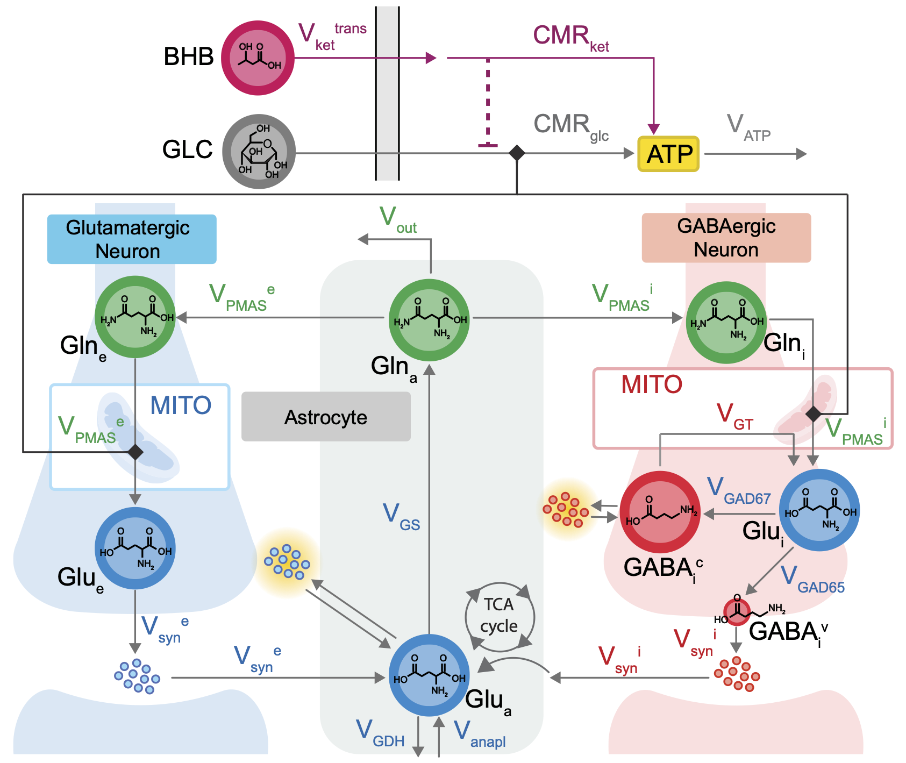

# Neurotransmitter Cycling Model

This repository contains a computational framework for modeling neurotransmitter cycling in the human brain, with a focus on glutamate and GABA dynamics in response to metabolic interventions.

This model is part of the Neuroblox computational neuroscience platform [(https://www.neuroblox.ai/)](https://www.neuroblox.ai/).

## Corresponding publication

*Computational modeling of neurotransmitter cycling predicts human brain glutamate and GABA dynamics in response to administration of exogenous ketones*  

(link to be added)

## Repository structure

- `GUI/`  
  Code for a web application that runs the model. A live version can be accessed here: https://nt-cycling.fly.dev/.

- `reproduce_paper/`  
  Code to reproduce the results reported in the corresponding publication.  

- `tutorial/`  
  A general tutorial demonstrating how to use the neurotransmitter cycling model for custom analyses and exploratory purposes.
