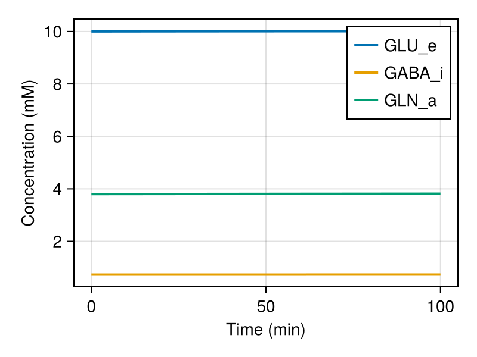
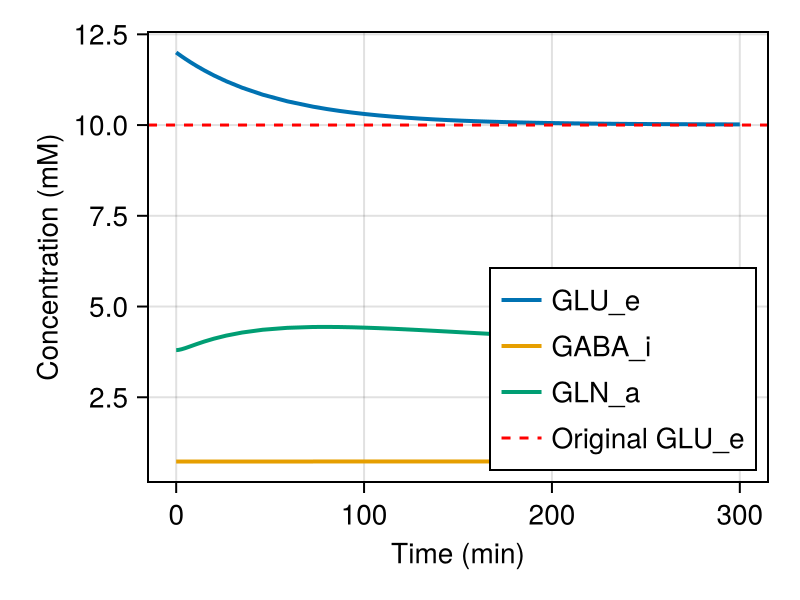
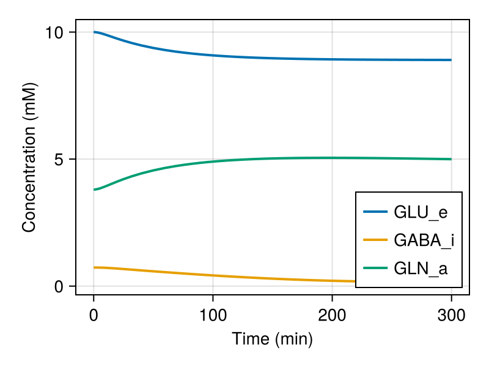
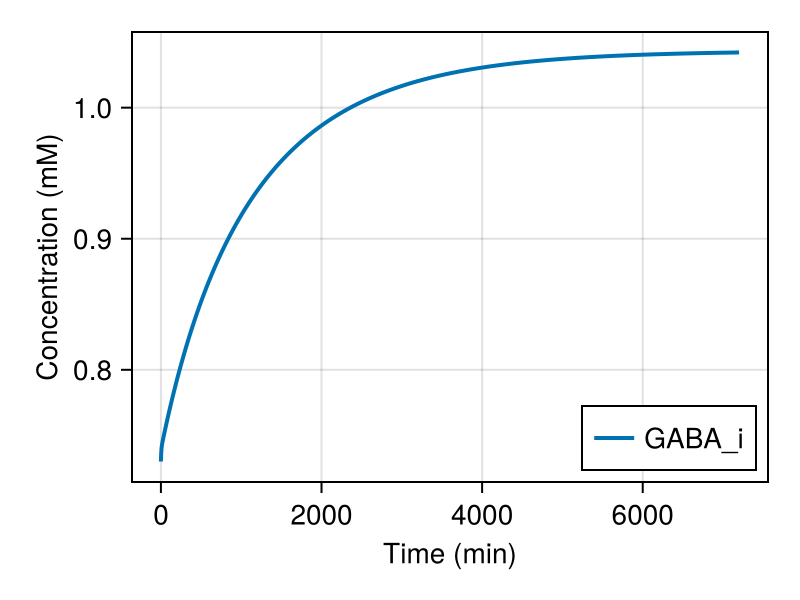

```@meta
EditURL = "tutorial.jl"
```

# Neuroblox Tutorial: Neurotransmitter Cycling Model

This tutorial will show you how to use the Neurotransmitter cycling module of Neuroblox.
We will cover the following points:
1. What is this model for?
2. Key concepts of Glutamate and GABA cycling
3. Basic usage
4. Examples

## 1. What is this model for?
This model lets us predict changes in the brain levels of glutamate and GABA
in response to various perturbations, such as changes in the rate of energy metabolism
or pharmacological interventions. The simulations will output how the concentrations of
these neurotransmitters change over time, and what the new steady-state concentrations are.

## 2. Key concepts of Glutamate and GABA cycling
Glutamate and GABA are the primary excitatory and inhibitory neurotransmitters in the brain.
Both are synthesized de novo in neurons, with GABA synthesis being specific to
GABAergic neurons.

Following synaptic release during neurotransmission, approximately 80% of released
glutamate and GABA is taken up by astrocytes and converted to glutamine, which is
subsequently transported back to neurons and converted to glutamate and GABA.
The recycling process is closely coupled to neuronal energy metabolism, helping
maintain a balance between neuronal signaling and its energetic demands across
varying levels of activity. One proposed coupling mechanism is the
pseudo-malate-aspartate shuttle (PMAS).

The current model incorporates the key enzymatic reactions involved in
neurotransmitter cycling in neurons and astrocytes and couples them to neuronal
glucose metabolism via the PMAS. It integrates algebraic expressions and
differential equations into a unified framework, with parameters derived primarily
from in vivo studies. In addition, the model includes equations describing ketone
pharmacokinetics in the brain, enabling the simulation of ketosis and its effects
on neurotransmitter cycling.


## 3. Basic usage
The Neurotransmitter cycling module provides a simple way to set up a model of neurotransmitter cycling.
The model is defined in the `NTModel.jl` file, which contains the `NTModel` struct.
First, make sure you have the module file in your workspace, then follow the steps below.

Import the necessary packages:

````@example tutorial
using OrdinaryDiffEq
using Catalyst
using CairoMakie
using Main.NTModelModule
````

Create an instance of the NTModel:

````@example tutorial
ntmodel = NTModel();
nothing #hide
````

By default, the model is set up with initial conditions that correspond to a steady state.
The initial conditions are defined in the `u0` field of the `NTModel` struct.
The parameters are defined in the `ps` field.

From the model, we can create an ODEProblem as usual and solve it:

````@example tutorial
prob = ODEProblem(ntmodel.model, ntmodel.u0, (0.0, 100.0), ntmodel.ps);
sol = solve(prob, Tsit5());
nothing #hide
````

Then plot the results:

````@example tutorial
fig = Figure(size=(400, 300))
ax = Axis(fig[1, 1])
for state in [:GLU_e, :GABA_i, :GLN_a]
    lines!(ax, sol.t, sol[state], linewidth=2, label=string(state))
end
axislegend(ax)
ax.xlabel = "Time (min)"
ax.ylabel = "Concentration (mM)"
display(fig)
````



The time-series are flat because the default initial conditions are in steady-state for the default parameters.

Now let's change one of the initial conditions to see how the model responds.

We'll save the original value of glutamate in excitatory neurons (10 mM) and then set it to 12 mM:

````@example tutorial
GLU_e_original = ntmodel.u0[:GLU_e];
ntmodel.u0[:GLU_e] = 12.0;
nothing #hide
````

We'll run the simulation again with the new initial conditions:

````@example tutorial
prob = ODEProblem(ntmodel.model, ntmodel.u0, (0.0, 300.0), ntmodel.ps);
sol = solve(prob, Tsit5());
nothing #hide
````

And then, we'll check how the system responds to the change in initial conditions:

````@example tutorial
fig = Figure(size=(400, 300))
ax = Axis(fig[1, 1])
for state in [:GLU_e, :GABA_i, :GLN_a]
    lines!(ax, sol.t, sol[state], linewidth=2, label=string(state))
end
hlines!(ax, GLU_e_original, color=:red, linestyle=:dash, label="Original GLU_e")
axislegend(ax, position=:rb)
ax.xlabel = "Time (min)"
ax.ylabel = "Concentration (mM)"
display(fig)
````



We can see that the system returns to the original steady state after the perturbation.

## 4. Examples
### Example 1: Effect of ketosis
In this example, we will simulate the effect of ketosis on neurotransmitter cycling.
Ketosis is a metabolic state characterized by elevated levels of ketone bodies in the
blood. The corresponding model parameter is KetP.
We will set the initial concentration of ketone bodies to 3 mM (originally 0 mM)
and run the simulation.

Start with a fresh instance of the NTModel:

````@example tutorial
ntmodel = NTModel();
nothing #hide
````

Set the initial concentration of plasma ketone bodies to 3 mM:

````@example tutorial
ntmodel.ps[:KET_p] = 3.0;
nothing #hide
````

Run the simulation:

````@example tutorial
prob = ODEProblem(ntmodel.model, ntmodel.u0, (0.0, 300.0), ntmodel.ps);
sol = solve(prob, Tsit5());
nothing #hide
````

Plot the results:

````@example tutorial
fig = Figure(size=(400, 300))
ax = Axis(fig[1, 1])
for state in [:GLU_e, :GABA_i, :GLN_a]
    lines!(ax, sol.t, sol[state], linewidth=2, label=string(state))
end
axislegend(ax, position=:rb)
ax.xlabel = "Time (min)"
ax.ylabel = "Concentration (mM)"
display(fig)
````



We can see that in this case, the system returns to a new steady state after the perturbation.

### Example 2: Effect of GABA-T inhibition
In this example, we will simulate the effect of ketosis on neurotransmitter cycling.
Ketosis is a metabolic state characterized by elevated levels of ketone bodies in the
blood.
Ketone bodies are transported from the blood into the brain, where they can serve as
an alternative energy substrate alongside glucose, thereby altering neuronal
metabolism. This may consequently affect neurotransmitter cycling, as it is tightly
coupled to cellular energy metabolism.
Here, we use the model to predict how ketosis affects neuronal metabolism and
neurotransmitter cycling.
The model parameter corresponding to plasma ketone concentration is KetP.
To simulate ketosis, we will set the initial ketone concentration to 3 mM
(originally 0 mM) and run the simulation.

Start with a fresh instance of the NTModel:

````@example tutorial
ntmodel = NTModel();
nothing #hide
````

Reduce the Vmax parameter of GABA-T by 5%:

````@example tutorial
ntmodel.ps[:Vmax_GT] *= 0.95;
nothing #hide
````

Run the simulation

````@example tutorial
prob = ODEProblem(ntmodel.model, ntmodel.u0, (0.0, 7200.0), ntmodel.ps);
sol = solve(prob, Tsit5());
nothing #hide
````

We will plot GABA_i only as the Glutamate/Glutamine concentrations are
not expected to change significantly:

````@example tutorial
fig = Figure(size=(400, 300))
ax = Axis(fig[1, 1])
lines!(ax, sol.t, sol[:GABA_i], linewidth=2, label="GABA_i")
axislegend(ax, position=:rb)
ax.xlabel = "Time (min)"
ax.ylabel = "Concentration (mM)"
display(fig)
````



Here we see that GABA concentrations rise significantly after the inhibition of GABA-T.

## Conclusion
In this tutorial, we showed how to simulate neurotransmitter cycling
using the neurotransmitter cycling module in Neuroblox.
The resulting steady-state concentrations of glutamate and GABA
can be incorporated into models of neuronal activity
to explore how different perturbations in neurotransmitter cycling
may impact brain function.

## GUI
You can also interact with the neurotransmitter cycling model through a graphical user interface,
available [here](https://neuroblox.ai/metabolic/neurotransmitter\_cycling).

## Read more
Sibson, Nicola R., et al. "Stoichiometric coupling of brain glucose metabolism and glutamatergic neuronal activity." Proceedings of the National Academy of Sciences 95.1 (1998): 316-321.

Rothman, Douglas L., et al. "Glucose sparing by glycogenolysis (GSG) determines the relationship between brain metabolism and neurotransmission." Journal of Cerebral Blood Flow & Metabolism 42.5 (2022): 844-860.

Andersen, Jens V., Arne Schousboe, and Alexei Verkhratsky. "Astrocyte energy and neurotransmitter metabolism in Alzheimer’s disease: Integration of the glutamate/GABA-glutamine cycle." Progress in Neurobiology 217 (2022): 102331.

Rothman, Douglas L., Kevin L. Behar, and Gerald A. Dienel. "Mechanistic stoichiometric relationship between the rates of neurotransmission and neuronal glucose oxidation: Reevaluation of and alternatives to the pseudo‐malate‐aspartate shuttle model." Journal of Neurochemistry 168.5 (2024): 555-591.

---

*This page was generated using [Literate.jl](https://github.com/fredrikekre/Literate.jl).*

